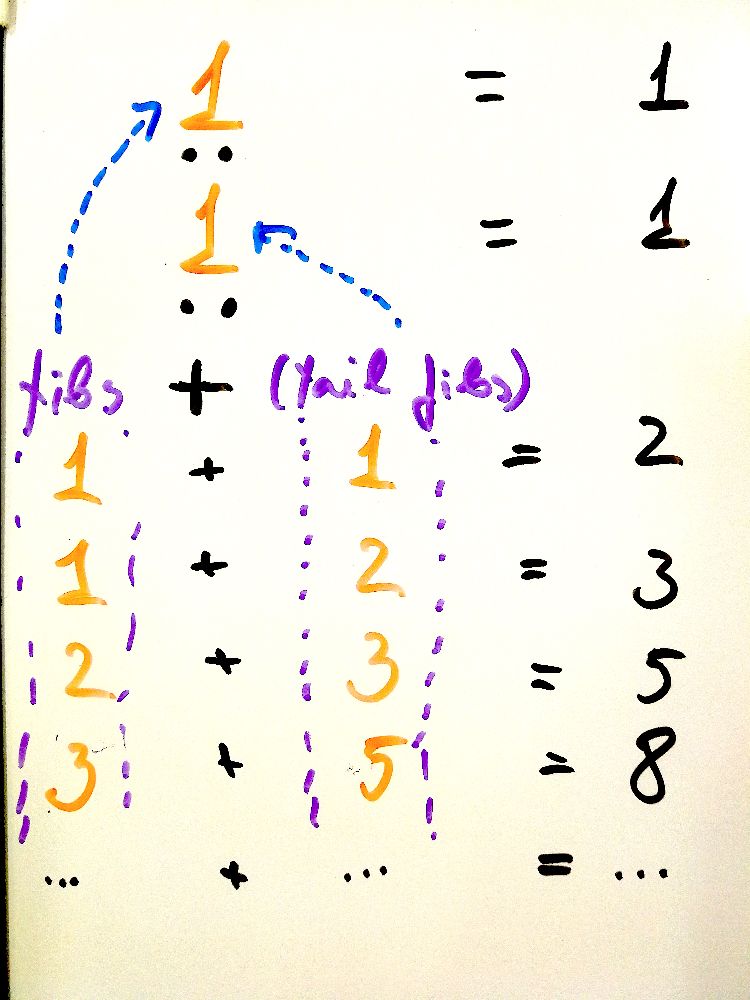

name: FP
layout: true
class:

---
# Introduction to Functional Programming

.large[.right[***Šarūnas Valaškevičius, 2018***]]
---
## What to expect

- an overview of Functional Programming and basic concepts
- basic Haskell syntax (yes, we'll use Haskell!)
- being able to build a program!

---
## Why Haskell?

- It's purely functional, so it's easier to identify the concepts being explained.
- Paradigm concepts are easily translated to other languages, such as Scala
- Because it's awesome
- It does not allow you to shoot yourself in the foot
- Because it's elegant and clean, it becomes easy to read once you know the
  minimal syntax

---
## Functional programming

Simply put, it is programming with functions.

A function is:

- a description of a computation (a mapping from its input values to an output value);
- a value that can be passed over (or be returned from) to another function.

```Haskell
myFunction :: Arg1Type -> Arg2Type -> ... -> ReturnType
myFunction arg1 arg2 ... = body
```

We can call the function like this:

```Haskell
myFunction arg1 arg2
```

Functions can also be *pure* and *total*.

---
## Pure functions
A function where the return value can only be affected by its input parameters, and it does not
produce any observable side-effect is called a *pure* function - the only effect of the function is
the produced return value.

- this property is called *referential transparency*
- it allows *equational reasoning*:

```Haskell
y = f x
g y == g (f x)
```

Or, if we know that `f x` is 42, we could simply replace `g y` with `g 42` and be sure that the
program still works exactly the same.

---
## Total functions
A function is called *total* when it has a return value for every combination of its possible
input values.

For example, a total function could look like this:
```Haskell
f :: Integer -> Integer
f x = 2*x
```

Another example, where the function is only defined for just some input values, is **not** a total function:

```Haskell
f :: Integer -> Integer -> Integer
f x y = x `div` y
```

Let's try:

```
> f 4 2
2
> f 4 0
*** Exception: divide by zero
```

---
## Defining data types

```Haskell
data MyType = MyIntType Int | MyEmptyType | MyStringType String
```

Defines a new type `MyType` and provides three alternative data constructors:
 - `MyIntType` has one Integer parameter
 - `MyEmptyType` has no parameters
 - `MyStringType` has one String parameter


```Haskell
> let x = MyIntType 1
> :type x
x :: MyType
```

---
## List

A data structure that keeps a list of elements of the same type.

```Haskell
data List a = Nil | Cons a (List a)
```

A list can either be empty list `Nil`, or `Cons`, that prepends an element of type `a` to a list of the same type.

A list of type `a` in Haskell is denoted as `[a]`. `Nil` is represented as `[]` and `Cons` - `:`.

```Haskell
> [1, 2, 3]
[1,2,3]
> 1 : 2: 3 : []
[1,2,3]
```

Some common functions:
 - `head [1, 2, 3] = 1`
 - `tail [1, 2, 3] = [2, 3]`
 - `take 2 [1, 2, 3] = [1, 2]`

---
## Ranges

A simple way to create lists of number ranges, is to use the `..` operator.
For example:

```Haskell
> [1..5]
[1,2,3,4,5]
```


We can specify the increment amount for a range by telling the compiler what
the second elment of the sequence will be:

```Haskell
> [1,3..11]
[1,3,5,7,9,11]
```

Ranges can be used to create lists of characters:

```Haskell
> ['a'..'f']
"abcdef"
> ['a','c'..'z']
"acegikmoqsuwy"
```

---
## Ranges

We can also create infinite lists of numbers by not specifying the end limit
value for the range, as so:

```Haskell
[1..]
```

Because Haskell is lazy, you can create such lists and the compiler will be
able to handle them.

---
## Going further


Let's look as some more advanced features provided by Haskell:

 - Pattern matching
 - Strong type system
 - Curried functions
 - Lambda functions
 - Composing two functions
 - Higher order functions
 - Lazy evaluation

---
## Pattern matching
- powerful alternative for many `if` statements
- functions are written in declarative manner
- destructuring matches

```Haskell
maybeDiv :: Int -> Int -> Maybe Int
maybeDiv _ 0 = Nothing
maybeDiv a b = Just (a `div` b)
```

If the second parameter is `0`, the function will match the first case - `maybeDiv _ 0` and
return `Nothing` as the result - parameters marked with `_` match everything and are ignored.
For all other cases, the second line will match as the default case:
`maybeDiv a b` and capture the argument values as `a` and `b`.

```Haskell
maybeDiv 10 2 == Just 5 -- True
maybeDiv 10 0 == Nothing -- True
```

---
## Pattern matching

Let's create a Fibonacci number generator!

```Haskell
fib :: Integer -> Integer
fib 0 = 1
fib 1 = 1
fib n = fib (n-1) + fib (n-2)
```

 - First the input argument is matched against the literal `0` - if it matches the function returns `1` (`fib 0 = 1`).
 - Otherwise, it is matched against the literal number `1` - if it matches the function returns `1` (`fib 1 = 1`).
 - If the above checks don't match, the input argument is matched against a variable `n`, which will match *any value* that was passed to the function, and place it in the variable `n`. At this point, the variable `n` can be used in the expression on the right side to make recursive calls to `fib` (`fib n = fib (n-1) + fib (n-2)`).

---
## Destructuring matching

```Haskell
maybePlus :: Int -> Maybe Int -> Maybe Int
maybePlus a (Just b) = Just (b + a)
maybePlus _ Nothing = Nothing
```

If the second parameter is a value of `Just t` - a possible value of `Maybe Int` type, it matches
the first case and labels the integer contained in the value as `t`. Alternatively, the second case
matching `maybePlus _ Nothing` will capture all inputs where the second argument is `Nothing`.

```Haskell
maybePlus 10 (Just 5) == Just 15 -- True
maybePlus 10 Nothing == Nothing -- True
```

or, combined with the function defined earlier:

```Haskell
maybePlus 10 (maybeDiv 10 2) == Just 15 -- True
maybePlus 10 (maybeDiv 10 0) == Nothing -- True
```

---
## Strong typing

- *"If it type-checks, it's most likely good"*
- types not only help to ensure that a program works correctly, but also provide a headline of
what a function is doing
- for convenience, most compilers implement type inference

```Haskell
maybePlus :: Int -> Maybe Int -> Maybe Int

...

maybePlus (maybeDiv 10 0) 10
```

```
<interactive>:58:12: error:
    • Couldn't match expected type ‘Int’ with actual type ‘Maybe Int’
    • In the first argument of ‘maybePlus’, namely ‘(maybeDiv 10 0)’
      In the expression: maybePlus (maybeDiv 10 0) 10
      In an equation for ‘it’: it = maybePlus (maybeDiv 10 0) 10
```

---
## Strong typing

```Haskell
map :: (a -> b) -> [a] -> [b]
```

Given the above function signature, we can already say what the function is doing:
 - given a function `(a -> b)`
 - and a list `[a]`
 - it will map over the list, applying the given function and return a list of its return values

Note: the example here uses variable types, and Haskell will infer the actual types based on the
usage of the function - as long as the types marked with the same letter (a or b) are the same, the
function will work correctly.

---
## Curried functions

All functions in Haskell either return the end result or a function to get it:

```Haskell
f :: a -> b -> c
```

`f 3` has type `(b -> c)`, which is a function itself. An example of this can be a sum:

```Haskell
addNumbers x y = x + y
addFive = addNumbers 5
addFive 2 -- will return 7
```

`addNumbers 5` returns a function that takes one parameter `y` and results in `5 + y`.

In Haskell, all functions are curried.

---
## Lambda functions

It is frequently convenient to express simple functions anonymously - without assigning a specific
label to them, but rather just "embedding" them in the function call directly - as seen in the example
below, where 5 is being added to every element of the list.

The syntax to declare a lambda function is: `\parameters -> body`.

```Haskell
map (\x -> x+5) [1..]
```

Why "`\`"? Because `(\` resembles a lambda symbol (if you squint hard enough).

---
## Composing two functions

In Haskell, it is possible to compose two functions to one using the `.` operator:

```Haskell
foo :: Int -> String
foo = show

bar :: String -> [String]
bar x = [x]

foobar = bar . foo

foobar 5  -- ["5"]
```

```Haskell
> :info foobar
foobar :: Int -> [String]
```

`bar` composed with `foo` will call the function `foo` first, and pass its results to the argument of `bar` returning the final results.

---
## Composing two functions

The `.` operator is not a specific language construct - like many others, it is a simple function, defined in the *Prelude*:

```Haskell
(.) :: (b -> c) -> (a -> b) -> (a -> c)
(.) f g = \x -> f (g x)
```

It takes two functions `b -> c` (`f`) and `a -> b` (`g`), and returns a function of type `a -> c`, hiding the intermediate type `b` by passing it directly to the function `f`. As it does not capture the argument of type `a` in the argument list, this implementation uses a *lambda function* to capture it as `x`.

Alternatively, this could be written as:

```Haskell
(.) :: (b -> c) -> (a -> b) -> (a -> c)
(.) f g x = f (g x)
```

Note: *Prelude* is a standard library enabled by default for all Haskell programs.

---
## Higher order functions

Wikipedia:
> *In mathematics and computer science, a higher-order function is a function that does at least one of the following:*
>
> - *takes one or more functions as an input*
> - *outputs a function*

For example, *map* and *fold* (reduce) are very common higher order functions in functional paradigm.

```Haskell
> :type map
map :: (a -> b) -> [a] -> [b]

> :type foldl
foldl :: Foldable t => (b -> a -> b) -> b -> t a -> b
```

---
## Lazy evaluation

- most programming languages use eager evaluation
- but some start to implement lazy *generators*
- Haskell is **lazy**: it will only compute a value when it is actually used
- memory requirements are less explicit and more difficult to reason about
- however, it is very convenient - allows "infinite" computation definitions (e.g. an infite list is
  expressed as `[1..]`):

```Haskell
> take 5 [1..]
[1,2,3,4,5]
```

---
## ... or even

```Haskell
fibs :: [Integer]
fibs = 1 : 1 : zipWith (+) fibs (tail fibs)
```

.pull-right[]

This defines a Fibonacci sequence, as an infinite recursive function.

When calculating, e.g. `take 10 fibs`, it will return `[1,1,2,3,5,8,13,21,34,55]`, where:

1. it starts with `[1, 1]`
2. 2 was generated as 1+1 (sum of first and the second values of `fibs`)
3. once we have 2, it generates the next element - this time `1 + 2`
4. and so on, until we get 55 - which is the 10th element.

As we only requested 10 elements, Haskell will stop after calculating the 10th element and will
not be stuck calculating the sequence numbers forever, even
though there is no exit condition defined in the function `fibs`.

---
# A practical example

---
## Let's build an application!

We'll start with a simple one - an application
that prints sorted numerical arguments.

---
## Defining main

```Haskell
main :: IO ()
main = return ()
```

A minimal program that does nothing at all.  It defines an empty `main` function that Haskell uses as the entry point.

You'll notice that it hast type of `IO a` - a context that is allowed to execute I/O functions.

---
## Unit ()

In Haskell `()` is called Unit. Unit is used to denote a type that carries no
information. It is often used when causing side-effects which will have no
useful information to give back. For example:

```Haskell
hello :: IO ()
hello = putStrLn "Hello World"
```
In this case printing a string has no relevant value to return, so it returns
`()`. In this example, `()` is wrapped in the context of `IO` because that's the only context
where side-effects are allowed in Haskell.

---
## The `return` function

```Haskell
main :: IO ()
main = return ()
```

In Haskell, the return value of a function is the result of evaluation the
expression inside of that function. As so, there's is no motive to have a
`return` keyword as you find in other languages.
There is though, a `return` function in Haskell, but it does something
completely different from what you may be used to.

In Haskell, `return` is a function that will give you back a value wrapped inside the
context of the expression it is at. It sounds more complicated than what it
really is. In the example above, it returns `()` in the context of `IO`, so
`IO ()`

---
## IO type

Because Haskell is a pure functional programming language, it does not allow printing, or doing any other side-effects in pure logic functions.

*But how do we implement a useful program then?!*

The answer is - `IO` monad.

---
## Monad?

A simple description is - it allows defining chained actions in a specific context. A convenient way to express such chained actions is using the *do notation*:

```Haskell
worldType :: IO String
worldType = return "Haskell"

main :: IO()
main = do
    whatWorld <- worldType
    let fullText = "hello " ++ whatWorld ++ " world"
    putStrLn fullText
```

---
## Monad

```Haskell
worldType :: IO String
worldType = return "Haskell"

main :: IO()
main = do
    whatWorld <- worldType
    let fullText = "hello " ++ whatWorld ++ " world"
    putStrLn fullText
```

The "Do" notation allows you to extract a value which is inside of a context (the
right side of the `<-` expression), out of that context. This allows you to
use it in a chain of such expressions. The last expression in the do notation,
will be returned as the result, and it needs to be in the same context (in the
above example IO).

---
## App arguments

```Haskell
import System.Environment (getArgs)

main :: IO()
main = do
    args <- getArgs
    return ()
```

To access the program arguments, we will import a standard Haskell function `getArgs` which, as it needs to interact with the environment, is also defined in the `IO` context and returns the arguments as a list of strings:

```
> :info System.Environment.getArgs
System.Environment.getArgs :: IO [String]
```

---
## Sort!

Let's implement our sorting algorithm:

```Haskell
quicksort [] = []
quicksort (p:xs) = (quicksort lesser) ++ [p] ++ (quicksort greater)
    where
        lesser = filter (< p) xs
        greater = filter (>= p) xs
```

While not the most efficient, however a quite simple implementation of a popular sorting algorithm.

Notice, that it does not need to interact with I/O and is considered a *pure* function.

Also, it does not have a function signature! This lets the Haskell compiler to infer the actual types based on both the usage and implementation of the function as we'll see in the further examples.

---
## ...sort

But how can we use it?

```Haskell
main :: IO()
main = do
    args <- getArgs
    putStrLn (quicksort args)
```

An error!

```
test.hs:12:15: error:
    • Couldn't match type ‘[Char]’ with ‘Char’
      Expected type: String
        Actual type: [String]
    • In the first argument of ‘putStrLn’, namely ‘(quicksort args)’
      In a stmt of a 'do' block: putStrLn (quicksort args)
      In the expression:
        do { args <- getArgs;
             putStrLn (quicksort args) }
```

`putStrLn` expects a single string, instead of a list of strings!

---
## Print result

`putStrLn` expects a single string, instead of a list of strings! To fix this, we'll use `intercalate` function imported from the `Data.List` module.

```Haskell
import Data.List (intercalate)

main :: IO()
main = do
    args <- getArgs
    putStrLn (intercalate " " (quicksort args))
```

It's working!

```
# runghc test.hs 10 100 20
10 100 20
```

But what's this? `20` should be before `100`!

---
## Sorting as integers

`20` should be before `100`! The reason, as you might have guessed, is that Haskell sorted the arguments as strings. Let's convert the arguments to integers:

```Haskell
import Data.Maybe (catMaybes)

main :: IO()
main = do
    args <- getArgs
    let integerArgs = (catMaybes (map readMaybe args))::[Int]
    putStrLn (intercalate " " (map show (quicksort integerArgs)))
```

That's better:

```
runghc test.hs 10 100 20 asd
10 20 100
```

Note: to convert the integers back to strings, we have used the `show` function.

---
## Combine functions

As we have a working application, let's make it a bit nicer. We'll create small, descriptive functions to be able to *read* the program easily:

```Haskell
extractIntegers :: [String] -> [Int]
extractIntegers = catMaybes . map readMaybe

formatString = intercalate " " . map show

sortStringsAsIntegers = formatString . quicksort . extractIntegers

main :: IO()
main = do
    args <- getArgs
    putStrLn (sortStringsAsIntegers args)
```

---
## Final result
```Haskell
import System.Environment (getArgs)
import Data.List (intercalate)
import Text.Read (readMaybe)
import Data.Maybe (catMaybes)

quicksort [] = []
quicksort (p:xs) = (quicksort lesser) ++ [p] ++ (quicksort greater)
    where
        lesser = filter (< p) xs
        greater = filter (>= p) xs

extractIntegers :: [String] -> [Int]
extractIntegers = catMaybes . map readMaybe

formatString = intercalate " " . map show

sortStringsAsIntegers = formatString . quicksort . extractIntegers

main :: IO()
main = do
    args <- getArgs
    putStrLn (sortStringsAsIntegers args)
```
---
# N-Grams example

---
## What is an n-gram?

An n-gram is a continuous sequence of *n* items from a given sample of text.

For example, a list of tri-grams:

```
An n-gram is
n-gram is a
is a continuous
...
```

We can represent it as trees with probabilities of word occurrence:

```
I ------> am -----> going  (100%)

am -----> going --> to     (50%)
                `-> home   (50%)

going --> to -----> work   (50%)
      |      `----> school (50%)
      |
      `-> home ---> [END]  (100%)
```

---
## How can we use it?

```
I ------> am -----> going  (100%)

am -----> going --> to     (50%)
                `-> home   (50%)

going --> to -----> work   (50%)
      |      `----> school (50%)
      |
      `-> home ---> [END]  (100%)
```

We can use this model as a *Markov chain* (from Oxford dictionaries):

> A stochastic model describing a sequence of possible events in which the probability of each event depends only on the state attained in the previous event.

This allows us to generate sentences, resembling the text used to generate tri-grams, although the semantics of the result will be lost.

---
## Let's define our type

We'll use a multi-branched tree structure, where, starting from the root of the tree, we can "drill down" to the n-gram statistics by selecting the next word in the n-gram.

```haskell
data Tree a b = Tree !(Map a (Tree a b)) !b deriving (Show)

type NGrams = Tree String Integer
```

First, we define a generic `Tree` type, that contains a value of type `b` and a map, where keys are of a given type `a`, and values - a recursive definition of the same type `Tree a b`.

But hey! What's that `!`? Haskell, being a lazy language, does not alway calculate the results and put in variables. Instead, the default behaviour is for variables to hold information how to calculate the value, and only calculate it when it is needed for the first time (*Lazyness*). `!` makes this type to calculate the values immediatelly, instead of deferring it. It is called the *Strictness operator*.

Our `NGrams` type is simply a type alias to a `Tree` type, where the key is going to be a `String` and the value for each node - an `Integer`. We'll use it as a counter to tell how many times has this n-gram occured in our text.

---
## Adding text

## Generating new sentences

## Quiz

##


---
# Thanks!

.top-right[]
